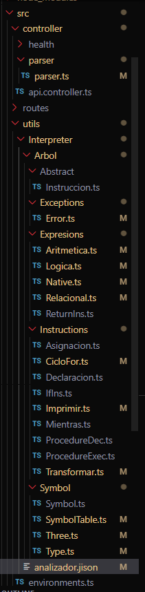

# Manual Técnico - Traductor de SQL

## Descripción del proyecto
El objetivo de este proyecto es crear una aplicación web que permita traducir texto en lenguaje SQL al presionar un botón de "traducir". Además, se debe proporcionar un botón de "limpiar" para borrar el contenido traducido. La aplicación se desarrolla utilizando Node.js con TypeScript en el backend y React en el frontend.

## Requisitos técnicos
- Backend:
  - Node.js
  - TypeScript
  - Express.js 
- Frontend:
  - React
  - React Router 
- Herramientas de construcción:
  - Gestor de paquetes: npm o Yarn
  - Webpack (opcional, para empaquetar y construir la aplicación)

## Estructura del proyecto

El proyecto sigue la siguiente estructura de carpetas para el server: 


en la cual donde se encuentran todas el codigo necesario para que el programa copile se encuentra en utils/Interpreter/Arbol en la cual esta se subdibide en diferentes ramas 


- Interpreter/
- Arbol/
    - Abstract/   
        - Instruccion.ts
    - Exections/
        - Error.ts
    - Expressions/
        - Aritmetica.ts
        - Logica.ts
        - Native.ts
        - Relacional.ts
        - ReturnIns.ts
    - Instructions/
        - Asignacion.ts
        - CicloFor.ts
        - IfIns.ts
        - Imprimir.ts
        - Mientras.ts
        - ProcedureDec.ts
        - ProcedureIzq.ts
        - Transformar.ts
    - Symbols/
        - Symbol.ts
        - Type.ts
        - Three.ts
        - Type.ts


Esta estructrua fue disenada en base a un repositorio de un auxiliar del primer semestre del 2023, el cual se le realizaron modificaciones y se la agregaron funcionalidades para que este pueda copilar a la froma que se desea implementar para este proyecto. 


### Parser

en esta esta esctructura de codigo, es donde manejamos las instrucciones que se han generado a lo largo del JISON, en la cual estas van retornando las intrucciones en el analizador.js, y estas se vaan haciendo una lista, la cual posteriormentes se conforme estas se fueron analzando, estas se van almacenando para posterior mente en el res.json. Esta ya devuelve todo como una respuesta al cliente, como un lenguaje ya copilado. 

```TypeScript
import { Response, Request } from "express";
import Errores from '../../utils/Interpreter/Arbol/Exceptions/Error';
import Three from "../../utils/Interpreter/Arbol/Symbol/Three";
import SymbolTable from "../../utils/Interpreter/Arbol/Symbol/SymbolTable";
import { Instruccion } from "../../utils/Interpreter/Arbol/Abstract/Instruccion";
import express from 'express';


export let listaErrores: Array<Errores> = [];

export const parser = (req: Request & unknown, res: Response): void => {
  const graphviz = require('graphviz');
    listaErrores = new Array<Errores>();
    console.log("este es el tamno de la lista" + listaErrores.length)
    let parser = require('../../utils/Interpreter/analizador');
    const { peticion } = req.body;
    try { 
      const returnThree = parser.parse(peticion)
      let ast = new Three(returnThree);
      var tabla = new SymbolTable();
      ast.settablaGlobal(tabla);
      for (let i of ast.getinstrucciones()) {
        if (i instanceof Errores) {
          listaErrores.push(i);
          console.log("esto es un error "+i)
          ast.actualizaConsola((<Errores>i).returnError());
        }
        //console.log(i)
        
        var resultador = i instanceof Instruccion ? i.interpretar(ast, tabla) : new Errores("ERROR SEMANTICO", "no se puede ejecutar la instruccion", 0, 0);
        if (resultador instanceof Errores) {
          listaErrores.push(resultador);
          ast.actualizaConsola((<Errores>resultador).returnError());
        }        
      }      
      
      const arbolGrafo = ast.getTree("ast");
      
      res.json({ consola: ast.getconsola(), grafo: arbolGrafo, errores: listaErrores, simbolos: [] });
    } catch (err) {
        console.log(err)
        res.json({ consola: '', error: err, errores: listaErrores, simbolos: [] });
    }
}

```

### Instruccion
En esta parte podemos observar que esta se va derivando de un arbol, el cual se ha podido observar en el paraser, esta se va manenado las instruccioens segun como se van ingresando, para una instruccion nosotros recibumos como paramereo, el tipo de la instrucciones que se va a realizar, la linea donde se encuentra la instruccion como ademas en su columna. Esta instruccion se va usando varias veces a lo largo del programa, ya que esta la usamos para cuando se manda una ciclo, una sentencia if, un while, como ademas las declaraciones de variables o bien las operaciones, ya que dependiendo de lo que se contenga de lado izquierdo o derecho esta se ira operando.


```TypeScript
import Arbol from '../Symbol/Three';
import tablaSimbolo from '../Symbol/SymbolTable';
import Tipo from '../Symbol/Type';

export abstract class Instruccion {
  public tipoDato: Tipo;
  public linea: number;
  public columna: number;

  constructor(tipo: Tipo, linea: number, columna: number) {
    this.tipoDato = tipo;
    this.linea = linea;
    this.columna = columna;
  }

  abstract interpretar(arbol: Arbol, tabla: tablaSimbolo): any;
}
```
### CicloFor

En este ciclo for, podemos observar el rango, el cual obtenemos dos parametros el lado izwquierod y su lado derecho, en el cual se ira operando conforme estos se vayan operando. Como ademas contiene la lista de istrucciones en la cual son las se van entrando, asi como se ha mencionado antes estas se van almacenando conforme estas van eanalizando.


```TypeScript
import { Instruccion } from '../Abstract/Instruccion';
import Arbol from '../Symbol/Three';
import tablaSimbolo from '../Symbol/SymbolTable';
import Tipo, {DataType} from '../Symbol/Type';
import SymbolTable from '../Symbol/SymbolTable';
import cloneDeep from 'lodash/cloneDeep';

export default class CicloFor extends Instruccion {
    private Ran1: Instruccion;
    private Ran2: Instruccion;
    private listaInstrucciones: Instruccion [];    

    constructor(
        Ran1: Instruccion, 
        Ran2: Instruccion,
        listaInstrucciones: Instruccion[], 
        linea: number, 
        columna: number
    ){
        super(new Tipo(DataType.INDEFINIDO), linea, columna);
        this.Ran1 = Ran1
        this.Ran2 = Ran2
        this.listaInstrucciones = listaInstrucciones
    }
    public interpretar(arbol: Arbol, tabla: tablaSimbolo) {
        const tablaLocal = new SymbolTable(tabla)
        let valueIzq = Number(this.Ran1.interpretar(arbol, tabla));
        let valueDer = Number(this.Ran2.interpretar(arbol, tabla));
        //console.log("este es el rango  " + valueIzq )
        //console.log("este es el rango  " + valueDer )
        if (valueIzq < valueDer){
            while( valueIzq != valueDer){   
                const instructionsToExec = cloneDeep(this.listaInstrucciones)    
                for(let i of instructionsToExec){
                    i.interpretar(arbol, tablaLocal)
                }
                valueIzq +=1
                //console.log("por aqui voy "+valueIzq)
            }
        } else if if (valueIzq > valueDer){
            while( valueIzq != valueDer){   
                const instructionsToExec = cloneDeep(this.listaInstrucciones)    
                for(let i of instructionsToExec){
                    i.interpretar(arbol, tablaLocal)
                }
                valueIzq -=1
                //console.log("por aqui voy "+valueIzq)
            }
        }
        return null;
    }
}


```


### Impresion

Para esta clase, el cual copilamos una instrucciones  esta la muestra en consola, de igual manera, esta recibe una instruccion la cual se va desenglozando y al final muestra lo que se esta operando, la cual en aritmetica, se desarrollo ya sea si viene decimales o si esta cadenaesta se concaten, dependiendo del tipo de variable esta actua y se va operando, la cual se vera en el siguiente titulo.

```TypeScript
import { Instruccion } from '../Abstract/Instruccion';
import Errores from '../Exceptions/Error';
import Three from '../Symbol/Three';
import SymbolTable from '../Symbol/SymbolTable';
import Type, { DataType } from '../Symbol/Type';

export default class Imprimir extends Instruccion {
  private expresion: Instruccion;

  constructor(expresion: Instruccion, linea: number, columna: number) {
    super(new Type(DataType.INDEFINIDO), linea, columna);
    this.expresion = expresion;
  }

  public interpretar(arbol: Three, tabla: SymbolTable) {
    let valor = this.expresion.interpretar(arbol, tabla);
    if (valor instanceof Errores) return valor;
    //console.log(valor)
    arbol.actualizaConsola(valor + '');
  }
}
```

### Arimetica
Como se mencionaba anteriormente en este se trabajan todo tipo de operaciones ya sea de concatenacion, o una suma normal o una operacion aritmetica, se trabajo la concatenacion es esta clase para evitar segior creadno mas archivos y que a su vez sea mas facil al momento de crear el analizador, ya que esta generalizara todas las acciones que estas conetengan.

```TypeScript
import { Instruccion } from '../Abstract/Instruccion';
import Arbol from '../Symbol/Three';
import tablaSimbolo from '../Symbol/SymbolTable';
import Tipo, { DataType } from '../Symbol/Type';

export default class Aritmetico extends Instruccion {
    operacionIzq: Instruccion;
    operacionDer: Instruccion;
    tipo: tipoOp;


    constructor(tipo: tipoOp, opIzq: Instruccion, opDer: Instruccion, fila: number, columna: number) {
        super(new Tipo(DataType.INDEFINIDO), fila, columna);
        this.tipo = tipo;
        this.operacionIzq = opIzq;
        this.operacionDer = opDer;
    }

    interpretar(arbol: Arbol, tabla: tablaSimbolo) {
        if (this.tipo == tipoOp.SUMA) {
            let valueIzq = this.operacionIzq.interpretar(arbol, tabla);
            let valueDer = this.operacionDer.interpretar(arbol, tabla);
            
            if (this.operacionIzq.tipoDato.getTipo() == DataType.DECIMAL) {
                if (this.operacionDer.tipoDato.getTipo() == DataType.DECIMAL) {
                    this.tipoDato.setTipo(DataType.DECIMAL);
                    //console.log((valueIzq) + (valueDer))
                    return (Number(valueIzq) + Number(valueDer));
                } else if (this.operacionDer.tipoDato.getTipo() == DataType.CADENA) {
                    this.tipoDato.setTipo(DataType.CADENA);
                    return (`${valueIzq.toString()} + ${valueDer.toString()}`);
                } 
            }if (this.operacionIzq.tipoDato.getTipo() == DataType.CADENA) {
                if (this.operacionDer.tipoDato.getTipo() == DataType.DECIMAL) {
                    this.tipoDato.setTipo(DataType.DECIMAL);
                     return (`${valueIzq.toString()} ${valueDer.toString()}`);
                } else if (this.operacionDer.tipoDato.getTipo() == DataType.CADENA) {
                    this.tipoDato.setTipo(DataType.CADENA);
                    return (`${valueIzq.toString()} ${valueDer.toString()}`);
                }
            }


        } else if (this.tipo === tipoOp.RESTA) {
            let valueIzq = this.operacionIzq.interpretar(arbol, tabla);
            let valueDer = this.operacionDer.interpretar(arbol, tabla);
            //console.log("este es el valor izquierdo" + valueIzq);
            //console.log("este es el valor derecho" + valueDer);
            if (this.operacionIzq.tipoDato.getTipo() === DataType.DECIMAL) {
                if (this.operacionDer.tipoDato.getTipo() === DataType.DECIMAL) {
                    this.tipoDato.setTipo(DataType.DECIMAL);
                    return (Number(valueIzq) - Number(valueDer));
                }
            }
        } else if (this.tipo === tipoOp.MULTIPLICACION) {
            let valueIzq = this.operacionIzq.interpretar(arbol, tabla);
            let valueDer = this.operacionDer.interpretar(arbol, tabla);
            if (this.operacionIzq.tipoDato.getTipo() === DataType.DECIMAL) {
                if (this.operacionDer.tipoDato.getTipo() === DataType.DECIMAL) {
                    this.tipoDato.setTipo(DataType.DECIMAL);
                    return (Number(valueIzq) * Number(valueDer));
                }
            }
        } else if (this.tipo === tipoOp.DIVISION) {
            let valueIzq = this.operacionIzq.interpretar(arbol, tabla);
            let valueDer = this.operacionDer.interpretar(arbol, tabla);
            if (this.operacionIzq.tipoDato.getTipo() === DataType.DECIMAL) {
                if (this.operacionDer.tipoDato.getTipo() === DataType.DECIMAL) {
                    this.tipoDato.setTipo(DataType.DECIMAL);
                    return (Number(valueIzq)  / Number(valueDer));
                }
            }
        }else if (this.tipo === tipoOp.MOD) {
            let valueIzq = this.operacionIzq.interpretar(arbol, tabla);
            let valueDer = this.operacionDer.interpretar(arbol, tabla);
            if (this.operacionIzq.tipoDato.getTipo() === DataType.DECIMAL) {
                if (this.operacionDer.tipoDato.getTipo() === DataType.DECIMAL) {
                    this.tipoDato.setTipo(DataType.DECIMAL);
                    return (Number(valueIzq)  % Number(valueDer));
                }
            }
        }
        return null;
    }
}

export enum tipoOp {
    SUMA,
    RESTA,
    DIVISION,
    MULTIPLICACION,
    MOD
}

```
